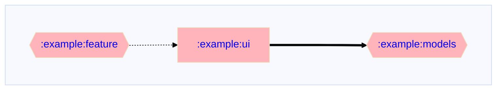
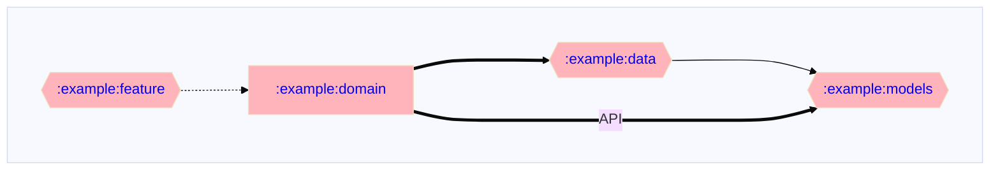

# Gradle 🐘 plugin de visualización de gráficos de dependencias
[](https://plugins.gradle.org/plugin/io.github.adityabhaskar.dependencygraph)
[](LICENSE)

[](https://github.com/adityabhaskar/Gradle-dependency-graphs/actions?query=workflow%3A%22Publish+Plugin+to+Portal%22)
[](https://github.com/adityabhaskar/Gradle-dependency-graphs/actions?query=workflow%3A%22Pre+Merge+Checks%22)

Un **Plugin de Gradle** que genera gráficos de dependencias mostrando la relación entre los módulos en tu proyecto.

El plugin genera un gráfico que visualiza las dependencias a lo largo de todo el proyecto. También genera sub-gráficos para cada módulo dentro del proyecto. Para proyectos con una gran cantidad de módulos, encuentro que los sub-gráficos suelen ser mucho más útiles.

Los gráficos se generan en el formato [`mermaid.js`](https://mermaid.js.org/syntax/flowchart.html#direction-in-subgraphs) por lo que se muestran automáticamente en Github.

Este plugin es una derivación del script de gráfico de dependencias de proyecto de [Jake Wharton](https://github.com/JakeWharton/) [disponible aquí](https://github.com/JakeWharton/SdkSearch/blob/master/gradle/projectDependencyGraph.gradle).

El plugin está disponible en el [repositorio de plugins de Gradle](https://plugins.gradle.org/plugin/io.github.adityabhaskar.dependencygraph).

## Cómo usarlo

### Aplicar el plugin

**Aplica el plugin** al archivo raíz `build.gradle.kts` de tu proyecto.

Kotlin:
```kotlin
plugins {
  id("io.github.adityabhaskar.dependencygraph") version "<version>"
}
```

Groovy:
```groovy
plugins {
  id "io.github.adityabhaskar.dependencygraph" version "<version>"
}
```

[Véase aquí](https://plugins.gradle.org/plugin/io.github.adityabhaskar.dependencygraph) para aplicarlo sin usar el bloque DSL de plugins.

### Usar el plugin

El plugin añade una nueva tarea de Gradle: `dependencyGraph`. Ejecutar la tarea generará los gráficos de dependencias para todos los módulos del proyecto.

```bash
./gradlew dependencyGraph
```

### Configurar el plugin

Opcionalmente, **configura el plugin** en el mismo `build.gradle.kts` si deseas cambiar los valores predeterminados.
```kotlin
dependencyGraphConfig {
    graphDirection.set(Direction.LeftToRight)

    showLegend.set(ShowLegend.OnlyInRootGraph)

    ignoreModules.set(listOf(":example:system-test", ":example:test-fixtures"))

    repoRootUrl.set("https://github.com/adityabhaskar/Gradle-dependency-graphs")

    mainBranchName.set("main")

    graphFileName.set("dependencyGraph.md")
}
```

#### Opciones de configuración

Todas las opciones de configuración son opcionales y cuentan con valores predeterminados sensatos.

| Opción de configuración | Tipo | Valor predeterminado | Descripción |
| --- | --- | --- | --- |
|`graphDirection`| `Direction` | `Direction.LeftToRight` | La dirección en la que se debe organizar el gráfico.<br>Opciones: <ul> <li><code>Direction.LeftToRight</code></li> <li><code>Direction.TopToBottom</code></li> <li><code>Direction.BottomToTop</code></li> <li><code>Direction.RightToLeft</code></li> </ul> |
| `showLegend` | `ShowLegend` | `ShowLegend.OnlyInRootGraph` | Si se debe mostrar una leyenda. Cuando está habilitado, el gráfico contendrá una leyenda que identifica diferentes tipos de módulos — actual/raíz, java/kotlin, Android y multiplataforma — y diferentes tipos de dependencias: directas, indirectas y transitivas.<br> Opciones: <ul> <li><code>ShowLegend.Always</code></li> <li><code>ShowLegend.OnlyInRootGraph</code></li> <li><code>ShowLegend.Never</code></li> </ul>|
| `graphFileName` | `String` |  `dependencyGraph.md` | Nombre del archivo en el que se guarda el gráfico. <br> **Nota**: <!--<ul> <li>-->Si el nombre de archivo proporcionado no termina en `.md`, se agregará la extensión. <!--</li><li>Intenta no usar `-` ni ningún carácter especial en el nombre del archivo. Esto interfiere con el formato del gráfico de mermaid al agregar enlaces. Si el nombre del archivo contiene algo distinto de `[a-zA-Z0-9]`, no se agregarán enlaces.</li> </ul>-->|
|`ignoreModules`|`List<String>`| `emptyList()` | Una lista de módulos que se ignorarán al generar el gráfico. Esto puede usarse, por ejemplo, para eliminar módulos de pruebas del sistema y ver solo el gráfico de producción.<br>Proporciona la ruta completa de los módulos que deseas ignorar, por ejemplo, `:live-feature:ui` en lugar de `:test-ui`. |
| `shouldLinkModuleText` | `Boolean` |  `true` | Si se deben agregar enlaces de sub-gráficos a los nombres de los módulos en los gráficos. Los enlaces son útiles para navegar rápidamente entre gráficos y sub-gráficos.<br>**Nota**: Para que los enlaces funcionen, se deben proporcionar `repoRootUrl` y `mainBranchName` |
| `repoRootUrl` | `String` | `""` | URL de Github de tu repositorio. Ej. `https://github.com/adityabhaskar/Gradle-dependency-graphs`<br>La URL se usa para agregar enlaces a los módulos y permitir la navegación al subgráfico de un módulo simplemente haciendo clic en él. Si no se proporciona una URL, no se agregarán enlaces al gráfico.<!--<br>**Nota**: En este momento, Github no admite navegación por clic desde gráficos de mermaid.-->|
| `mainBranchName`| `String` |`main`| Nombre de tu rama principal, por ejemplo, `master`.<br>Esto se combina con `repoRootUrl` para crear URLs clicables. Las URLs se usan para agregar enlaces al gráfico y permitir la navegación al subgráfico de un módulo haciendo clic en un módulo. Si no se proporciona `repoRootUrl`, no se agregarán enlaces al gráfico.<!--<br>**Nota**: En este momento, Github no admite navegación por clic desde gráficos de mermaid.-->|

## Gráficos de dependencias

### Gráfico de dependencias a nivel de proyecto

El plugin generará un gráfico en la raíz del proyecto para todos los módulos del proyecto (excepto los ignorados).

[Gráfico de proyecto raíz de ejemplo](dependencyGraph.md) con una leyenda:



### Gráfico de dependencias de submódulos

Además, el plugin generará un gráfico para las dependencias de cada módulo dentro del directorio raíz de dicho módulo. Este gráfico incluirá:
1. Dependientes directos del módulo, y
2. Dependencias directas e indirectas del módulo

_Los dependientes se identifican con una línea discontinua._

Ejemplo de [sub-gráfico para el módulo](https://github.com/adityabhaskar/Gradle-dependency-graphs/blob/main/example/domain/dependencyGraph.md) `:example:domain` sin leyenda:



## Integración con CI

> Esta sección es un trabajo en progreso

### Crear un PR con gráficos modificados

La acción [`update-graphs-pr.yaml`](/.github/workflows//update-graphs-pr.yaml) crea un nuevo PR con los gráficos de dependencias modificados cuando las dependencias de los módulos cambian en `main`.

1. La acción ejecuta la tarea del plugin `./gradlew :example:dependencyGraph` para generar gráficos de dependencias actualizados.
2. Un script sencillo - [`.github/ci-scripts/changed_files.sh`](/.github/ci-scripts/changed_files.sh) - recopila todos los archivos de gráficos modificados para que puedan listarse en el cuerpo del PR.
3. Usamos la acción [`peter-evans/create-pull-request`](https://github.com/peter-evans/create-pull-request) para crear un PR _solo si_ hay gráficos modificados.

Ejemplo de PR con gráficos modificados: https://github.com/adityabhaskar/Gradle-dependency-graphs/pull/16

### Confirmar gráficos modificados automáticamente

**TBD**: Acción de Github que confirmará automáticamente cualquier nuevo gráfico de dependencias en `main`.

## Contribuir 🤝

Siente libre de abrir un issue o enviar un pull request para cualquier error/mejora.

## Licencia 📄

Esta plantilla está licenciada bajo la Licencia MIT - consulta el archivo [Licencia](License) para más detalles.
