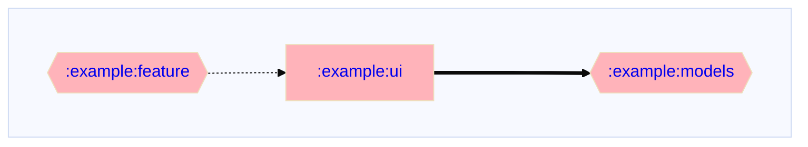
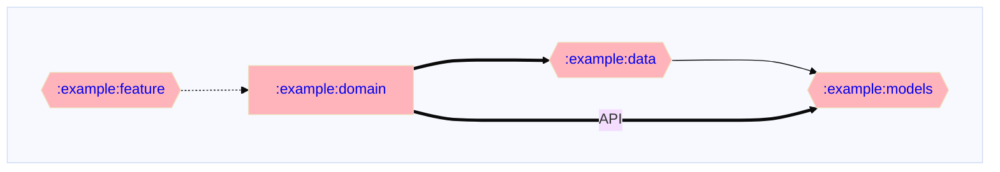

# Gradle 🐘 dependency graph visualisation plugin
[](https://plugins.gradle.org/plugin/io.github.adityabhaskar.dependencygraph)
[](LICENSE)

[](https://github.com/adityabhaskar/Gradle-dependency-graphs/actions?query=workflow%3A%22Publish+Plugin+to+Portal%22)
[](https://github.com/adityabhaskar/Gradle-dependency-graphs/actions?query=workflow%3A%22Pre+Merge+Checks%22)

A **Gradle Plugin** that generates dependency graphs showing the relationship between modules in your project.

The plugin generates a graph visualising the dependencies across the whole project. It also generates sub-graphs for each module within the project. For projects with a large number of modules, I find the sub-graphs tend to be a lot more useful.

The graphs are generated in the [`mermaid.js`](https://mermaid.js.org/syntax/flowchart.html#direction-in-subgraphs) format so they are automatically displayed by Github.

This plugin is a derivation of [Jake Wharton](https://github.com/JakeWharton/)'s project dependency graph script [available here](https://github.com/JakeWharton/SdkSearch/blob/master/gradle/projectDependencyGraph.gradle).

The plugin is available in the [Gradle plugins repository](https://plugins.gradle.org/plugin/io.github.adityabhaskar.dependencygraph).

## How to use

### Apply the plugin

**Apply the plugin** to your project's root `build.gradle.kts`

Kotlin:
```kotlin
plugins {
  id("io.github.adityabhaskar.dependencygraph") version "0.1.4"
}
```

Groovy:
```groovy
plugins {
  id "io.github.adityabhaskar.dependencygraph" version "0.1.4"
}
```

[See here](https://plugins.gradle.org/plugin/io.github.adityabhaskar.dependencygraph) for applying without the plugins DSL block.

### Using the plugin

The plugin adds a new Gradle task - `dependencyGraph`. Running the task will generate the dependency graphs for all modules in the project.

```bash
./gradlew dependencyGraph
```

### Configuring the plugin

Optionally **configure the plugin** in the same `build.gradle.kts` if you want to change the defaults
```kotlin
dependencyGraphConfig {
    graphDirection.set(Direction.LeftToRight)

    showLegend.set(ShowLegend.OnlyInRootGraph)

    ignoreModules.set(listOf(":example:system-test", ":example:test-fixtures"))

    repoRootUrl.set("https://github.com/adityabhaskar/Gradle-dependency-graphs")

    mainBranchName.set("main")

    graphFileName.set("dependencyGraph.md")
}
```

#### Configuration options

All configuration options are optional with sensible defaults.

| Config option | Type | Default value | Description |
| --- | --- | --- | --- |
|`graphDirection`| `Direction` | `Direction.LeftToRight` | The direction in which the graph should be laid out.<br>Options: <ul> <li><code>Direction.LeftToRight</code></li> <li><code>Direction.TopToBottom</code></li> <li><code>Direction.BottomToTop</code></li> <li><code>Direction.RightToLeft</code></li> </ul> |
| `showLegend` | `ShowLegend` | `ShowLegend.OnlyInRootGraph` | Whether to show a legend. When enabled, the graph with contain a legend identifying different types of modules — current/root, java/kotlin, Android and multiplatform — and different type of dependencies - direct, indirect & transitive.<br> Options: <ul> <li><code>ShowLegend.Always</code></li> <li><code>ShowLegend.OnlyInRootGraph</code></li> <li><code>ShowLegend.Never</code></li> </ul>|
| `graphFileName` | `String` |  `dependencyGraph.md` | Name of the file in which the graph is saved. <br> **Note**: <!--<ul> <li>-->If the provided filename does not end in `.md`, then the extension will be appended. <!--</li><li>Try not to use `-` or any special characters in the file name. This interferes with the mermaid graph format when adding links. If the file name contains anything other than `[a-zA-Z0-9]`, then links will not be added.</li> </ul>-->|
|`ignoreModules`|`List<String>`| `emptyList()` | A list of modules to be ignored when generating the graph. This may be used, for instance to remove system test modules to see only the production graph.<br>Provide the full path of the modules you want to ignore, e.g. `:live-feature:ui` instead of `:test-ui`. |
| `shouldLinkModuleText` | `Boolean` |  `true` | Whether to add sub-graph links to module names in graphs. The links are useful for quickly navigating between graphs and sub-graphs.<br>**Note**: For links to work `repoRootUrl` and `mainBranchName` need to be provided |
| `repoRootUrl` | `String` | `""` | Github URL for your repository. E.g. `https://github.com/adityabhaskar/Gradle-dependency-graphs`<br>The URL is used for adding links to modules to allow navigation to a module's subgraph just by clicking on it. If no URL is provided, then links are not added to the graph.<!--<br>**Note**: Github does not support click navigation from mermaid graphs at the moment.-->|
| `mainBranchName`| `String` |`main`| Name of your main branch, e.g. `master`.<br>This is combined with the `repoRootUrl` to create clickable URLs. The URLs are used for adding links to graph to allow navigation to a module's subgraph by clicking on a module. If no `repoRootUrl` is provided, then links are not added to the graph.<!--<br>**Note**: Github does not support click navigation from mermaid graphs at the moment.-->|

## Dependency graphs

### Project wide dependency graph

The plugin will generate one graph at the root of the project for all modules in the project (except any ignored).

[Sample root project graph](dependencyGraph.md) with a legend:



### Submodule dependency graph

Further, the plugin will generate a graph for every module's dependencies within that module's root folder. This graph will include:
1. Direct dependents of the module, and
2. Direct and indirect dependencies of the module

_Dependents are identified with a dashed line._

Sample [sub graph for the module](https://github.com/adityabhaskar/Gradle-dependency-graphs/blob/main/example/domain/dependencyGraph.md) `:example:domain` without a legend:



## CI integration

> This section is a work in progress

### Create a PR with changed graphs

The [`update-graphs-pr.yaml`](/.github/workflows//update-graphs-pr.yaml) action creates a new PR with changed dependency graphs when module dependencies change on `main`.

1. The action runs the plugin task `./gradlew :example:dependencyGraph` to generate fresh dependency graphs.
2. A simple script - [`.github/ci-scripts/changed_files.sh`](/.github/ci-scripts/changed_files.sh) - collects all the changed graph files so they can be listed in the PR body.
3. We use the [`peter-evans/create-pull-request`](https://github.com/peter-evans/create-pull-request) action to create a PR _only if_ there are any changed graphs.

Sample PR with changed graphs: https://github.com/adityabhaskar/Gradle-dependency-graphs/pull/16

### Commit changed graphs automatically

**TBD**: Github action that will automatically commit any new dependency graphs to `main`.

## Contributing 🤝

Feel free to open a issue or submit a pull request for any bugs/improvements.

## License 📄

This template is licensed under the MIT License - see the [License](License) file for details.