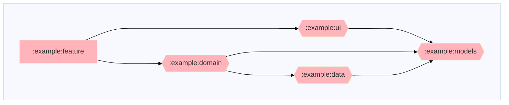

```mermaid
%%{ init: { 'theme': 'base' } }%%
graph LR;

%% Styling for module nodes by type
classDef rootNode stroke-width:4px;
classDef mppNode fill:#ffd2b3;
classDef andNode fill:#baffc9;
classDef javaNode fill:#ffb3ba;

%% Modules
subgraph  
  direction LR;
  :example:data{{:example:data}}:::javaNode;
  :example:models{{:example:models}}:::javaNode;
  :example:feature[:example:feature]:::javaNode;
  :example:ui{{:example:ui}}:::javaNode;
  :example:domain{{:example:domain}}:::javaNode;
end

%% Dependencies
:example:data--->:example:models
:example:feature--->:example:ui
:example:feature--->:example:domain
:example:ui--->:example:models
:example:domain--->:example:models
:example:domain--->:example:data

%% Dependents

%% Click interactions
click :example:data https://github.com/oorjalabs/todotxt-for-android/blob/main/example/data
click :example:models https://github.com/oorjalabs/todotxt-for-android/blob/main/example/models
click :example:feature https://github.com/oorjalabs/todotxt-for-android/blob/main/example/feature
click :example:ui https://github.com/oorjalabs/todotxt-for-android/blob/main/example/ui
click :example:domain https://github.com/oorjalabs/todotxt-for-android/blob/main/example/domain
```