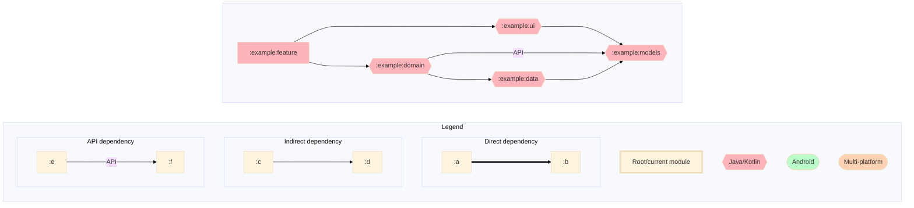

```mermaid
%%{ init: { 'theme': 'base' } }%%
graph LR;

%% Styling for module nodes by type
classDef rootNode stroke-width:4px;
classDef mppNode fill:#ffd2b3;
classDef andNode fill:#baffc9;
classDef javaNode fill:#ffb3ba;

%% Graph types
subgraph Legend
  direction TB;
  rootNode[Root/current module]:::rootNode;
  javaNode{{Java/Kotlin}}:::javaNode;
  andNode([Android]):::andNode;
  mppNode([Multi-platform]):::mppNode;
  subgraph Direct dependency
    direction LR;
    :a===>:b
  end
  subgraph Indirect dependency
    direction LR;
    :c--->:d
  end
  subgraph API dependency
    direction LR;
    :e--API--->:f
  end
end

%% Modules
subgraph  
  direction LR;
  :example:data{{:example:data}}:::javaNode;
  :example:domain{{:example:domain}}:::javaNode;
  :example:feature[:example:feature]:::javaNode;
  :example:models{{:example:models}}:::javaNode;
  :example:ui{{:example:ui}}:::javaNode;
end

%% Dependencies
:example:data--->:example:models
:example:feature--->:example:ui
:example:feature--->:example:domain
:example:ui--->:example:models
:example:domain--API--->:example:models
:example:domain--->:example:data

%% Dependents

%% Click interactions
click :example:data https://github.com/adityabhaskar/Project-Dependency-Graph/blob/main/example/data/dependencyGraph.md
click :example:domain https://github.com/adityabhaskar/Project-Dependency-Graph/blob/main/example/domain/dependencyGraph.md
click :example:feature https://github.com/adityabhaskar/Project-Dependency-Graph/blob/main/example/feature/dependencyGraph.md
click :example:models https://github.com/adityabhaskar/Project-Dependency-Graph/blob/main/example/models/dependencyGraph.md
click :example:ui https://github.com/adityabhaskar/Project-Dependency-Graph/blob/main/example/ui/dependencyGraph.md
```