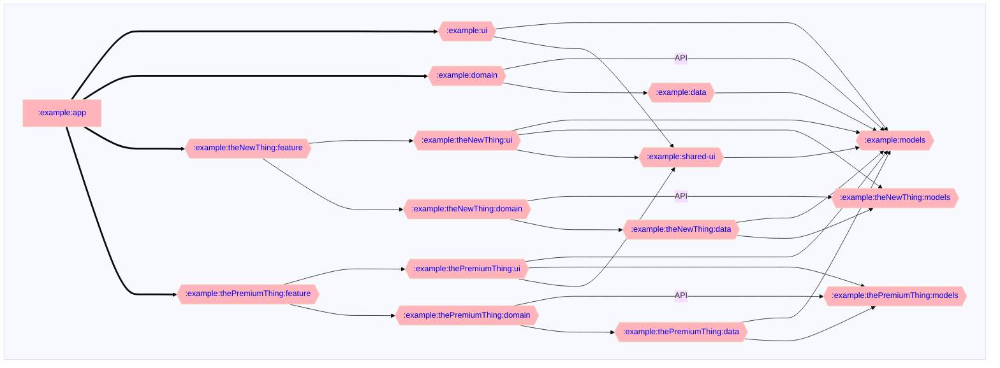

```mermaid
%%{ init: { 'theme': 'base' } }%%
graph LR;

%% Styling for module nodes by type
classDef rootNode stroke-width:4px;
classDef mppNode fill:#ffd2b3,color:#333333;
classDef andNode fill:#baffc9,color:#333333;
classDef javaNode fill:#ffb3ba,color:#333333;

%% Modules
subgraph  
  direction LR;
  :example:app[<a href='https://github.com/adityabhaskar/Gradle-dependency-graphs/blob/main/example/app/dependencyGraph.md' style='text-decoration:auto'>:example:app</a>]:::javaNode;
  :example:data{{<a href='https://github.com/adityabhaskar/Gradle-dependency-graphs/blob/main/example/data/dependencyGraph.md' style='text-decoration:auto'>:example:data</a>}}:::javaNode;
  :example:domain{{<a href='https://github.com/adityabhaskar/Gradle-dependency-graphs/blob/main/example/domain/dependencyGraph.md' style='text-decoration:auto'>:example:domain</a>}}:::javaNode;
  :example:models{{<a href='https://github.com/adityabhaskar/Gradle-dependency-graphs/blob/main/example/models/dependencyGraph.md' style='text-decoration:auto'>:example:models</a>}}:::javaNode;
  :example:shared-ui{{<a href='https://github.com/adityabhaskar/Gradle-dependency-graphs/blob/main/example/shared-ui/dependencyGraph.md' style='text-decoration:auto'>:example:shared-ui</a>}}:::javaNode;
  :example:theNewThing:data{{<a href='https://github.com/adityabhaskar/Gradle-dependency-graphs/blob/main/example/theNewThing/data/dependencyGraph.md' style='text-decoration:auto'>:example:theNewThing:data</a>}}:::javaNode;
  :example:theNewThing:domain{{<a href='https://github.com/adityabhaskar/Gradle-dependency-graphs/blob/main/example/theNewThing/domain/dependencyGraph.md' style='text-decoration:auto'>:example:theNewThing:domain</a>}}:::javaNode;
  :example:theNewThing:feature{{<a href='https://github.com/adityabhaskar/Gradle-dependency-graphs/blob/main/example/theNewThing/feature/dependencyGraph.md' style='text-decoration:auto'>:example:theNewThing:feature</a>}}:::javaNode;
  :example:theNewThing:models{{<a href='https://github.com/adityabhaskar/Gradle-dependency-graphs/blob/main/example/theNewThing/models/dependencyGraph.md' style='text-decoration:auto'>:example:theNewThing:models</a>}}:::javaNode;
  :example:theNewThing:ui{{<a href='https://github.com/adityabhaskar/Gradle-dependency-graphs/blob/main/example/theNewThing/ui/dependencyGraph.md' style='text-decoration:auto'>:example:theNewThing:ui</a>}}:::javaNode;
  :example:thePremiumThing:data{{<a href='https://github.com/adityabhaskar/Gradle-dependency-graphs/blob/main/example/thePremiumThing/data/dependencyGraph.md' style='text-decoration:auto'>:example:thePremiumThing:data</a>}}:::javaNode;
  :example:thePremiumThing:domain{{<a href='https://github.com/adityabhaskar/Gradle-dependency-graphs/blob/main/example/thePremiumThing/domain/dependencyGraph.md' style='text-decoration:auto'>:example:thePremiumThing:domain</a>}}:::javaNode;
  :example:thePremiumThing:feature{{<a href='https://github.com/adityabhaskar/Gradle-dependency-graphs/blob/main/example/thePremiumThing/feature/dependencyGraph.md' style='text-decoration:auto'>:example:thePremiumThing:feature</a>}}:::javaNode;
  :example:thePremiumThing:models{{<a href='https://github.com/adityabhaskar/Gradle-dependency-graphs/blob/main/example/thePremiumThing/models/dependencyGraph.md' style='text-decoration:auto'>:example:thePremiumThing:models</a>}}:::javaNode;
  :example:thePremiumThing:ui{{<a href='https://github.com/adityabhaskar/Gradle-dependency-graphs/blob/main/example/thePremiumThing/ui/dependencyGraph.md' style='text-decoration:auto'>:example:thePremiumThing:ui</a>}}:::javaNode;
  :example:ui{{<a href='https://github.com/adityabhaskar/Gradle-dependency-graphs/blob/main/example/ui/dependencyGraph.md' style='text-decoration:auto'>:example:ui</a>}}:::javaNode;
end

%% Dependencies
:example:app===>:example:ui
:example:app===>:example:domain
:example:app===>:example:theNewThing:feature
:example:app===>:example:thePremiumThing:feature
:example:data--->:example:models
:example:ui--->:example:models
:example:ui--->:example:shared-ui
:example:shared-ui--->:example:models
:example:domain--API--->:example:models
:example:domain--->:example:data
:example:theNewThing:data--->:example:models
:example:theNewThing:data--->:example:theNewThing:models
:example:theNewThing:feature--->:example:theNewThing:ui
:example:theNewThing:feature--->:example:theNewThing:domain
:example:theNewThing:ui--->:example:models
:example:theNewThing:ui--->:example:theNewThing:models
:example:theNewThing:ui--->:example:shared-ui
:example:theNewThing:domain--API--->:example:theNewThing:models
:example:theNewThing:domain--->:example:theNewThing:data
:example:thePremiumThing:data--->:example:models
:example:thePremiumThing:data--->:example:thePremiumThing:models
:example:thePremiumThing:feature--->:example:thePremiumThing:ui
:example:thePremiumThing:feature--->:example:thePremiumThing:domain
:example:thePremiumThing:ui--->:example:models
:example:thePremiumThing:ui--->:example:thePremiumThing:models
:example:thePremiumThing:ui--->:example:shared-ui
:example:thePremiumThing:domain--API--->:example:thePremiumThing:models
:example:thePremiumThing:domain--->:example:thePremiumThing:data

%% Dependents
```