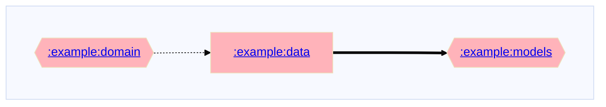

```mermaid
%%{ init: { 'theme': 'base' } }%%
graph LR;

%% Styling for module nodes by type
classDef rootNode stroke-width:4px;
classDef mppNode fill:#ffd2b3;
classDef andNode fill:#baffc9;
classDef javaNode fill:#ffb3ba;

%% Modules
subgraph  
  direction LR;
  :example:data[<a href="https://github.com/adityabhaskar/Gradle-dependency-graphs/blob/main/example/data/dependencyGraph.md">:example:data</a>]:::javaNode;
  :example:domain{{<a href="https://github.com/adityabhaskar/Gradle-dependency-graphs/blob/main/example/domain/dependencyGraph.md">:example:domain</a>}}:::javaNode;
  :example:models{{<a href="https://github.com/adityabhaskar/Gradle-dependency-graphs/blob/main/example/models/dependencyGraph.md">:example:models</a>}}:::javaNode;
end

%% Dependencies
:example:data===>:example:models

%% Dependents
:example:domain-.->:example:data

%% Click interactions
```