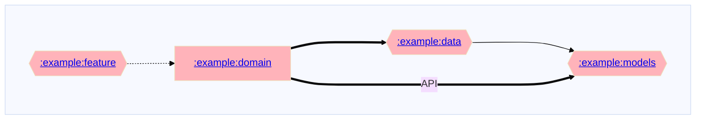

```mermaid
%%{ init: { 'theme': 'base' } }%%
graph LR;

%% Styling for module nodes by type
classDef rootNode stroke-width:4px;
classDef mppNode fill:#ffd2b3;
classDef andNode fill:#baffc9;
classDef javaNode fill:#ffb3ba;

%% Modules
subgraph  
  direction LR;
  :example:data{{<a href='https://github.com/adityabhaskar/Gradle-dependency-graphs/blob/main/example/data/dependencyGraph.md' style='color:#333;text-decoration:auto;'>:example:data</a>}}:::javaNode;
  :example:domain[<a href='https://github.com/adityabhaskar/Gradle-dependency-graphs/blob/main/example/domain/dependencyGraph.md' style='color:#333;text-decoration:auto;'>:example:domain</a>]:::javaNode;
  :example:feature{{<a href='https://github.com/adityabhaskar/Gradle-dependency-graphs/blob/main/example/feature/dependencyGraph.md' style='color:#333;text-decoration:auto;'>:example:feature</a>}}:::javaNode;
  :example:models{{<a href='https://github.com/adityabhaskar/Gradle-dependency-graphs/blob/main/example/models/dependencyGraph.md' style='color:#333;text-decoration:auto;'>:example:models</a>}}:::javaNode;
end

%% Dependencies
:example:data--->:example:models
:example:domain==API===>:example:models
:example:domain===>:example:data

%% Dependents
:example:feature-.->:example:domain
```