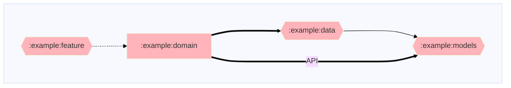

```mermaid
%%{ init: { 'theme': 'base' } }%%
graph LR;

%% Styling for module nodes by type
classDef rootNode stroke-width:4px;
classDef mppNode fill:#ffd2b3;
classDef andNode fill:#baffc9;
classDef javaNode fill:#ffb3ba;

%% Modules
subgraph  
  direction LR;
  :example:data{{:example:data}}:::javaNode;
  :example:domain[:example:domain]:::javaNode;
  :example:feature{{:example:feature}}:::javaNode;
  :example:models{{:example:models}}:::javaNode;
end

%% Dependencies
:example:data--->:example:models
:example:domain==API===>:example:models
:example:domain===>:example:data

%% Dependents
:example:feature-.->:example:domain

%% Click interactions
click :example:data https://github.com/adityabhaskar/Gradle-dependency-graphs/blob/main/example/data/dependencyGraph.md
click :example:domain https://github.com/adityabhaskar/Gradle-dependency-graphs/blob/main/example/domain/dependencyGraph.md
click :example:feature https://github.com/adityabhaskar/Gradle-dependency-graphs/blob/main/example/feature/dependencyGraph.md
click :example:models https://github.com/adityabhaskar/Gradle-dependency-graphs/blob/main/example/models/dependencyGraph.md
```