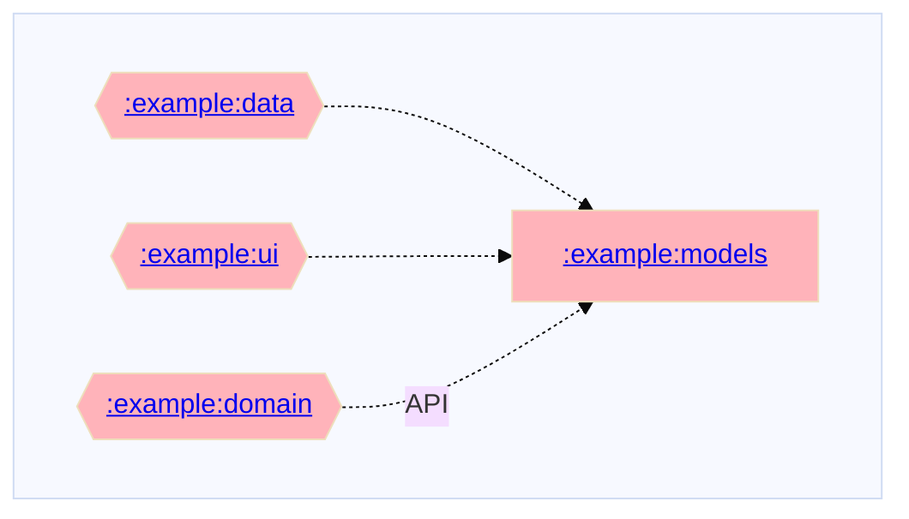

```mermaid
%%{ init: { 'theme': 'base' } }%%
graph LR;

%% Styling for module nodes by type
classDef rootNode stroke-width:4px;
classDef mppNode fill:#ffd2b3;
classDef andNode fill:#baffc9;
classDef javaNode fill:#ffb3ba;

%% Modules
subgraph  
  direction LR;
  :example:data{{<a href='/example/data/dependencyGraph.md' style='color:#333,text-decoration:auto'>:example:data</a>}}:::javaNode;
  :example:domain{{<a href='/example/domain/dependencyGraph.md' style='color:#333,text-decoration:auto'>:example:domain</a>}}:::javaNode;
  :example:models[<a href='/example/models/dependencyGraph.md' style='color:#333,text-decoration:auto'>:example:models</a>]:::javaNode;
  :example:ui{{<a href='/example/ui/dependencyGraph.md' style='color:#333,text-decoration:auto'>:example:ui</a>}}:::javaNode;
end

%% Dependencies

%% Dependents
:example:data-.->:example:models
:example:ui-.->:example:models
:example:domain-.API.->:example:models
```