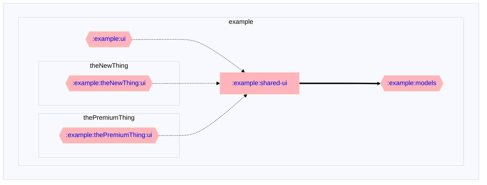

```mermaid
%%{ init: { 'theme': 'base' } }%%
graph LR;

%% Styling for module nodes by type
classDef rootNode stroke-width:4px;
classDef mppNode fill:#ffd2b3,color:#333333;
classDef andNode fill:#baffc9,color:#333333;
classDef javaNode fill:#ffb3ba,color:#333333;

%% Modules
subgraph  
  direction LR;

  subgraph example
    direction LR;
    :example:models{{<a href='https://github.com/adityabhaskar/Gradle-dependency-graphs/blob/main/example/models/dependencyGraph.md' style='text-decoration:auto'>:example:models</a>}}:::javaNode;
    :example:shared-ui[<a href='https://github.com/adityabhaskar/Gradle-dependency-graphs/blob/main/example/shared-ui/dependencyGraph.md' style='text-decoration:auto'>:example:shared-ui</a>]:::javaNode;
    :example:ui{{<a href='https://github.com/adityabhaskar/Gradle-dependency-graphs/blob/main/example/ui/dependencyGraph.md' style='text-decoration:auto'>:example:ui</a>}}:::javaNode;
    subgraph theNewThing
      direction LR;
      :example:theNewThing:ui{{<a href='https://github.com/adityabhaskar/Gradle-dependency-graphs/blob/main/example/theNewThing/ui/dependencyGraph.md' style='text-decoration:auto'>:example:theNewThing:ui</a>}}:::javaNode;
    end

    subgraph thePremiumThing
      direction LR;
      :example:thePremiumThing:ui{{<a href='https://github.com/adityabhaskar/Gradle-dependency-graphs/blob/main/example/thePremiumThing/ui/dependencyGraph.md' style='text-decoration:auto'>:example:thePremiumThing:ui</a>}}:::javaNode;
    end
  end
end

%% Dependencies
:example:shared-ui===>:example:models

%% Dependents
:example:ui-.->:example:shared-ui
:example:theNewThing:ui-.->:example:shared-ui
:example:thePremiumThing:ui-.->:example:shared-ui
```