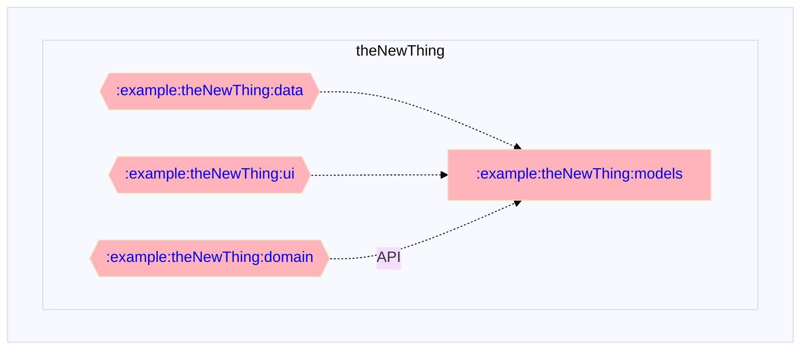

```mermaid
%%{ init: { 'theme': 'base' } }%%
graph LR;

%% Styling for module nodes by type
classDef rootNode stroke-width:4px;
classDef mppNode fill:#ffd2b3,color:#333333;
classDef andNode fill:#baffc9,color:#333333;
classDef javaNode fill:#ffb3ba,color:#333333;

%% Modules
subgraph  
  direction LR;


    subgraph theNewThing
      direction LR;
      :example:theNewThing:data{{<a href='https://github.com/adityabhaskar/Gradle-dependency-graphs/blob/main/example/theNewThing/data/dependencyGraph.md' style='text-decoration:auto'>:example:theNewThing:data</a>}}:::javaNode;
      :example:theNewThing:domain{{<a href='https://github.com/adityabhaskar/Gradle-dependency-graphs/blob/main/example/theNewThing/domain/dependencyGraph.md' style='text-decoration:auto'>:example:theNewThing:domain</a>}}:::javaNode;
      :example:theNewThing:models[<a href='https://github.com/adityabhaskar/Gradle-dependency-graphs/blob/main/example/theNewThing/models/dependencyGraph.md' style='text-decoration:auto'>:example:theNewThing:models</a>]:::javaNode;
      :example:theNewThing:ui{{<a href='https://github.com/adityabhaskar/Gradle-dependency-graphs/blob/main/example/theNewThing/ui/dependencyGraph.md' style='text-decoration:auto'>:example:theNewThing:ui</a>}}:::javaNode;
    end
end

%% Dependencies

%% Dependents
:example:theNewThing:data-.->:example:theNewThing:models
:example:theNewThing:ui-.->:example:theNewThing:models
:example:theNewThing:domain-.API.->:example:theNewThing:models
```