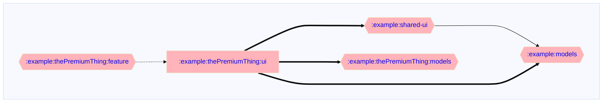

```mermaid
%%{ init: { 'theme': 'base' } }%%
graph LR;

%% Styling for module nodes by type
classDef rootNode stroke-width:4px;
classDef mppNode fill:#ffd2b3,color:#333333;
classDef andNode fill:#baffc9,color:#333333;
classDef javaNode fill:#ffb3ba,color:#333333;

%% Modules
subgraph  
  direction LR;
  :example:models{{<a href='https://github.com/adityabhaskar/Gradle-dependency-graphs/blob/main/example/models/dependencyGraph.md' style='text-decoration:auto'>:example:models</a>}}:::javaNode;
  :example:shared-ui{{<a href='https://github.com/adityabhaskar/Gradle-dependency-graphs/blob/main/example/shared-ui/dependencyGraph.md' style='text-decoration:auto'>:example:shared-ui</a>}}:::javaNode;
  :example:thePremiumThing:feature{{<a href='https://github.com/adityabhaskar/Gradle-dependency-graphs/blob/main/example/thePremiumThing/feature/dependencyGraph.md' style='text-decoration:auto'>:example:thePremiumThing:feature</a>}}:::javaNode;
  :example:thePremiumThing:models{{<a href='https://github.com/adityabhaskar/Gradle-dependency-graphs/blob/main/example/thePremiumThing/models/dependencyGraph.md' style='text-decoration:auto'>:example:thePremiumThing:models</a>}}:::javaNode;
  :example:thePremiumThing:ui[<a href='https://github.com/adityabhaskar/Gradle-dependency-graphs/blob/main/example/thePremiumThing/ui/dependencyGraph.md' style='text-decoration:auto'>:example:thePremiumThing:ui</a>]:::javaNode;
end

%% Dependencies
:example:shared-ui--->:example:models
:example:thePremiumThing:ui===>:example:models
:example:thePremiumThing:ui===>:example:thePremiumThing:models
:example:thePremiumThing:ui===>:example:shared-ui

%% Dependents
:example:thePremiumThing:feature-.->:example:thePremiumThing:ui
```