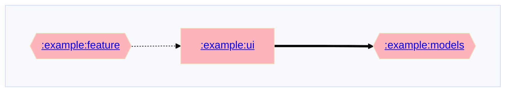

```mermaid
%%{ init: { 'theme': 'base' } }%%
graph LR;

%% Styling for module nodes by type
classDef rootNode stroke-width:4px;
classDef mppNode fill:#ffd2b3;
classDef andNode fill:#baffc9;
classDef javaNode fill:#ffb3ba;

%% Modules
subgraph  
  direction LR;
  :example:feature{{<a href='example/feature/dependencyGraph.md' style='color:#333,text-decoration:auto'>:example:feature</a>}}:::javaNode;
  :example:models{{<a href='example/models/dependencyGraph.md' style='color:#333,text-decoration:auto'>:example:models</a>}}:::javaNode;
  :example:ui[<a href='example/ui/dependencyGraph.md' style='color:#333,text-decoration:auto'>:example:ui</a>]:::javaNode;
end

%% Dependencies
:example:ui===>:example:models

%% Dependents
:example:feature-.->:example:ui
```