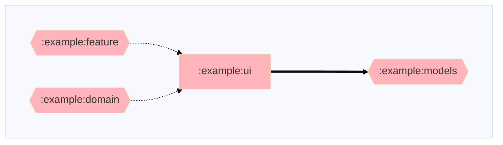

```mermaid
%%{ init: { 'theme': 'base' } }%%
graph LR;

%% Styling for module nodes by type
classDef rootNode stroke-width:4px;
classDef mppNode fill:#ffd2b3;
classDef andNode fill:#baffc9;
classDef javaNode fill:#ffb3ba;

%% Modules
subgraph  
  direction LR;
  :example:domain{{:example:domain}}:::javaNode;
  :example:feature{{:example:feature}}:::javaNode;
  :example:models{{:example:models}}:::javaNode;
  :example:ui[:example:ui]:::javaNode;
end

%% Dependencies
:example:ui===>:example:models

%% Dependents
:example:feature-.->:example:ui
:example:domain-.->:example:ui

%% Click interactions
click :example:domain https://github.com/adityabhaskar/Project-Dependency-Graph/blob/main/example/domain/dependencyGraph.md
click :example:feature https://github.com/adityabhaskar/Project-Dependency-Graph/blob/main/example/feature/dependencyGraph.md
click :example:models https://github.com/adityabhaskar/Project-Dependency-Graph/blob/main/example/models/dependencyGraph.md
click :example:ui https://github.com/adityabhaskar/Project-Dependency-Graph/blob/main/example/ui/dependencyGraph.md
```